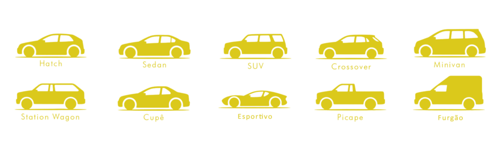

```{r setup, include = FALSE}

knitr::opts_chunk$set(
  collapse = TRUE,
  comment = "#>"
)
knitr::opts_chunk$set(warning = FALSE)
knitr::opts_chunk$set(message = FALSE)
# knitr::opts_chunk$set(cache   = TRUE)
knitr::opts_chunk$set(include = TRUE)
knitr::opts_chunk$set(echo    = FALSE)
```

```{r libs, include = FALSE}

packages <- c("readr",
              "dplyr",
              "ggplot2",
              "corrplot",
              "GGally",
              "knitr",
              "png",
              "rmarkdown",
              "pastecs",
              "RColorBrewer",
              "gridExtra",
              "car",
              "corrplot")

install_if_missing <- function(pkg) {
  if (!requireNamespace(pkg, quietly = TRUE)) {
    install.packages(pkg)
  }
}

lapply(packages, install_if_missing)
lapply(packages, library, character.only = TRUE)
```

```{r data, include = FALSE}

price        <- read_csv("auto-market-dataset/price.csv")
depreciation <- read_csv("auto-market-dataset/depreciation.csv")
applications <- read_csv("auto-market-dataset/applications.csv")
primary      <- read_csv("auto-market-dataset/primary_features.csv")
models       <- read_csv("auto-market-dataset/models.csv")
extra        <- read_csv("auto-market-dataset/extra_options.csv")
mans         <- read_csv("auto-market-dataset/mans.csv")

# Juntando as tabelas pelas chaves
data <- price %>%
  inner_join(extra,        by = "app_id")             %>%
  inner_join(depreciation, by = "app_id")             %>%
  inner_join(applications, by = "app_id")             %>%
  inner_join(primary,      by = "app_id")             %>%
  inner_join(mans,         by = c("man_id"   = "id")) %>%
  inner_join(models,       by = c("model_id" = "id")) %>%
  select(-ends_with(".y"))                            %>%
  rename_with(~ sub("\\.x$", "", .), ends_with(".x"))

data <- data %>%
  filter(is_car == TRUE)

data <- data %>%
  select(app_id,
         price,
         car_run_km,
         prod_year,
         engine_volume,
         cylinders,
         airbags,
         abs_break,
         esd,
         el_windows,
         conditioner,
         leather,
         nav_system,
         model_name,
         category,
         man_id,
         man_name, )

# Retirando registros inconsistentes
data_filter <- data %>%
  filter(price         > 1000 &
         car_run_km    > 1000 &
         engine_volume > 0    &
         cylinders     > 0)

# data_filter <- data_filter %>%
#   filter(price != 8388607)
```

# Introdução

O dataset foi escolhido pela plataforma kaggle e trata de observações sobre o **mercado automotivo online da Georgia** 🇬🇪 no ano de **2024**.

{width=75%}

Conforme o *schema* apresentado a seguir o dataset apresenta diversos detalhes sobre as vendas, condições do carro e outros detalhes mais específicos.

Para esse trabalho, com o intuito de enfatizar os processos e análises que foram aprendidos na disciplina, tomamos liberdade de manipular o banco fornecido no site e descosiderar variáveis não utilizadas no modelo.


---

Abaixo também apresentamos uma tabela com as variáveis que escolhemos enfatizar e serão tratadas no modelo linear simulado.

```{r data_head}

# kable(head(data))
paged_table(head(data))
```

# Explorando o banco de dados

Nos moldes que foram aplicados temos **`r nrow(data_filter)`** registros a serem analisados.

## Estatísticas gerais{.tabset}

### Quantitativas

Visão geral de variáveis quantitativas;
```{r resum_var}

aux <- stat.desc(data_filter)
aux <- aux[c(4, 5, 8, 9, 12), c(2:7)]

kable(aux, digits = 2)
```

### Categorias

Principais categorias de carros;

```{r rank_cat}

result <- aggregate(
  price ~ category,
  data = data_filter,
  FUN = function(x) c(count = length(x), mean = mean(x)))

result <- data.frame(
  category   = result$category,
  count      = result$price[, "count"],
  mean_price = result$price[, "mean"]
)

result <- result[order(-result$count), ]

kable(head(result),
      row.names = FALSE)
```

### Montadoras

Montadoras com mais registros;
```{r rank_man}

result <- aggregate(
  price ~ man_name,
  data = data_filter,
  FUN = function(x) c(count = length(x), mean = mean(x)))

result <- data.frame(
  man_name   = result$man_name,
  count      = result$price[, "count"],
  mean_price = result$price[, "mean"]
)

result <- result[order(-result$count), ]

kable(head(result, 10),
      row.names = FALSE)
```

## Graficos das variaveis {.tabset}
```{r}

cores <- brewer.pal(6, "Set2")
```

### Preço
```{r }
p1 <- ggplot(data, aes(x = "", y = price)) +
  geom_boxplot(fill = cores[1]) +
  theme_minimal()

h1 <- ggplot(data, aes(x = log(price))) +
  geom_histogram(fill = cores[1]) +
  theme_minimal()

grid.arrange(p1, h1, nrow = 1, ncol = 2)
```

### Quilometragem
```{r}
p2 <- ggplot(data, aes(x = "", y = car_run_km)) +
  geom_boxplot(fill = cores[2]) +
  theme_minimal()

h2 <- ggplot(data, aes(x = car_run_km)) +
  geom_histogram(fill = cores[2]) +
  theme_minimal()

grid.arrange(p2, h2, nrow = 1, ncol = 2)
```

### Ano do carro
```{r }
p3 <- ggplot(data, aes(x = "", y = prod_year)) +
  geom_boxplot(fill = cores[3]) +
  theme_minimal()

h3 <- ggplot(data, aes(x = prod_year)) +
  geom_histogram(fill = cores[3]) +
  theme_minimal()

grid.arrange(p3, h3, nrow = 1, ncol = 2)
```

### Volume do motor
```{r }
p4 <- ggplot(data, aes(x = "", y = engine_volume)) +
  geom_boxplot(fill = cores[4]) +
  theme_minimal()

h4 <- ggplot(data, aes(x = engine_volume)) +
  geom_histogram(fill = cores[4]) +
  theme_minimal()

grid.arrange(p4, h4, nrow = 1, ncol = 2)
```

### Cilindros
```{r }
p5 <- ggplot(data, aes(x = "", y = cylinders)) +
  geom_boxplot(fill = cores[5]) +
  theme_minimal()

h5 <- ggplot(data, aes(x = cylinders)) +
  geom_histogram(fill = cores[5]) +
  theme_minimal()

grid.arrange(p5, h5, nrow = 1, ncol = 2)
```

### Airbags
```{r}
p6 <- ggplot(data, aes(x = "", y = airbags)) +
  geom_boxplot(fill = cores[6]) +
  theme_minimal()
h6 <- ggplot(data, aes(x = airbags)) +
  geom_histogram(fill = cores[6]) +
  theme_minimal()

grid.arrange(p6, h6, nrow = 1, ncol = 2)
```

## Equação do modelo linear

A equação do modelo linear é dada por:

$$
\text{price} = \beta_0 + \beta_1 \cdot \text{car_run_km} + \beta_2 \cdot \text{prod_year} + \beta_3 \cdot \text{engine_volume} + \beta_4 \cdot \text{cylinders} + \beta_5 \cdot \text{airbags} + \beta_6 \cdot \text{abs_break} + \beta_7 \cdot \text{esd} + \beta_8 \cdot \text{el_windows} + \beta_9 \cdot \text{conditioner} + \beta_10 \cdot \text{leather} + \beta_11 \cdot \text{nav_system}
$$

```{r mult 1}

model_filter <- lm(price ~ car_run_km
                  + prod_year
                  + engine_volume
                  + cylinders
                  + airbags
                  + abs_break
                  + esd
                  + el_windows
                  + conditioner
                  + leather
                  + nav_system, data = data_filter)

summary(model_filter)
```

Apenas algumas variáveis apresentaram significância no modelo. Assim, o próximo modelo será construído excluindo as variáveis com p-valor maior que 0,05

```{r mult 2}
model_filter <- lm(price ~ car_run_km
                  + prod_year
                  + engine_volume
                  + cylinders
                  + airbags
                  + abs_break
                  + nav_system, data = data_filter)

summary(model_filter)
```

## Interpretação dos Coeficientes

$$
\text{price} = \beta_0 + \beta_1 \cdot \text{car_run_km} + \beta_2 \cdot \text{prod_year} + \beta_3 \cdot \text{engine_volume} + \beta_4 \cdot \text{cylinders} + \beta_5 \cdot \text{airbags} + \beta_6 \cdot \text{abs_break}  + \beta_7 \cdot \text{nav_system}
$$

- $\beta_0$ (intercept) nos indica que o valor esperado quando do veículo quando todas variáveis independentes são iguais a zero. Logo o beta_0 não tem interpretação prática pois o ano de produção não pode ser 0.

- ***car_run_km*** (Quilometragem): Para cada quilômetro adicional rodado, o preço do veículo diminuí em média -0.02 unidades monetárias, mantendo todas as outras variáveis constantes.

- ***prod_year*** (Ano de produção): Para cada ano adicional de produção, o preço do veículo aumenta em média 634.40 unidades monetárias, mantendo todas as outras variáveis constantes.

- ***engine_volume*** (volume do motor) : Para cada unidade adicional no volume do motor, o preço do veículo aumenta em média 2.47 unidades monetárias, mantendo todas as outras variáveis constantes.

- ***cylinders*** (cilindro adicional):  Para cada cilindro adicional, o preço do veículo aumenta em média 1682.0 unidades monetárias, mantendo todas as outras variáveis constantes.

- ***airbags*** Para cada airbags, o preço do veículo diminui em média -423.1 unidades monetárias, mantendo todas as outras variáveis constantes.

- ***abs_break*** (Sistema de freio)  Para presença de ABS, o aumento esperado na variável resposta é 1905 unidades monetárias, mantendo todas as outras variáveis constantes.

- ***nav_system*** (Sistema de navegação) Para presença de Sistema de navegação, o aumento esperado na variável resposta é 1389 unidades monetárias, mantendo todas as outras variáveis constantes.

## Interpretação do teste F

**F-statistic**: 248.9 \
**p-valor**: < 2.2e-16 \
**Adjusted R-squared**: 0.03107

- **F-statistic**: O valor de 248.9 indica que a variabilidade explicada pelo modelo é significativamente maior do que a variabilidade não explicada. Em outras palavras, o modelo como um todo é significativo.

- **p-valo**r: O p-valor é extremamente pequeno (< 2.2e-16), o que significa que a probabilidade de observar um valor de F tão extremo, ou mais extremo, sob a hipótese nula é praticamente zero.

- **Adjusted R-squared**: Apenas cerca de 3.1% da variabilidade dos dados observados é explicada pelo modelo ajustado.

- **Conclusão**:
  Apesar do modelo ser estatisticamente significativo como um todo, com um p-valor extremamente pequeno (< 2.2e-16), sua capacidade explicativa é muito limitada, conforme evidenciado pelo $R^2$ ajustado de apenas 3.1%. Isso indica que o modelo consegue explicar apenas uma pequena fração da variabilidade nos preços dos carros.

  Portanto, prosseguiremos com a análise detalhada dos resíduos, buscando identificar possíveis outliers ou padrões que possam estar influenciando negativamente o desempenho do modelo e comprometendo sua capacidade preditiva.

## Voltando a equação...

$$
\text{price} = \beta_0 + \beta_1 \cdot \text{car_run_km} + \beta_2 \cdot \text{prod_year} + \beta_3 \cdot \text{engine_volume} + \beta_4 \cdot \text{cylinders} + \beta_5 \cdot \text{airbags} + \beta_6 \cdot \text{abs_break}  + \beta_7 \cdot \text{nav_system}
$$
Substituindo os valores dos coeficientes estimados, temos:

$$
\begin{align*}
\text{price} = &\ -1,275,000 - 0.02198 \cdot \text{car_run_km} + 634.4 \cdot \text{prod_year} + 2.478 \cdot \text{engine_volume} \\
&+ 1,682 \cdot \text{cylinders} - 423.1 \cdot \text{airbags} + 1,905 \cdot \text{abs_break} + 1,389 \cdot \text{nav_system}
\end{align*}
$$

## Multicolinearidade
Outliers podem distorcer as relações entre variáveis, afetando correlações e métricas como o VIF, o que pode dar uma falsa impressão da gravidade da multicolinearidade. Para minimizar esses efeitos, analisamos a multicolinearidade tanto na escala original quanto na logarítmica, já que a transformação logarítmica ajuda a estabilizar a variância e reduzir a influência de valores extremos.

### Escala original
```{r multicolinearidade, echo=FALSE}
data_filter <- data_filter %>%
  select(price,
         nav_system,
         car_run_km,
         prod_year,
         cylinders,
         airbags,
         abs_break,
         engine_volume)

corrplot(cor(data_filter), method="number", order="hclust", addrect=2, diag=F)
```

```{r}
vif_values <- vif(model_filter)
kable(vif_values, col.names = c("VIF"))
```

Com base nas correlações moderadas entre algumas variáveis explicativas e os baixos valores de VIF (entre 1 e 2), evidenciando que a multicolinearidade não é um problema relevante neste modelo, pois, embora algumas variáveis apresentem covariância moderadas entre si, elas não estão redundantes a ponto de inflacionar a variância dos coeficientes.

### Com escala log
```{r}
data_filter_log <- data_filter %>%
  mutate(across(where(is.numeric), ~ ifelse(. > 0, log(.), .)))

corrplot(cor(data_filter_log, use = "complete.obs"),
         method = "number",
         order = "hclust",
         addrect = 2,
         diag = FALSE)
```

```{r}
model_filter_log <- lm(price ~ nav_system + car_run_km + prod_year + cylinders + airbags + abs_break + engine_volume,
                       data = data_filter_log)

vif_values_log <- vif(model_filter_log)

kable(data.frame(Variáveis = names(vif_values_log), VIF = vif_values_log), col.names = c("Variável", "VIF"))
```

Mesmo ao aplicar a transformação logarítmica, os valores do VIF permaneceram baixos, indicando que a multicolinearidade não é um problema relevante neste modelo.

## Análise de resíduos


## Transformação em log escala


```{r modelo log}
model_log <- lm(log(price) ~ car_run_km
                  + prod_year
                  + cylinders
                  + airbags
                  + abs_break
                + nav_system,
                data = data_filter)


summary(model_log)
```
