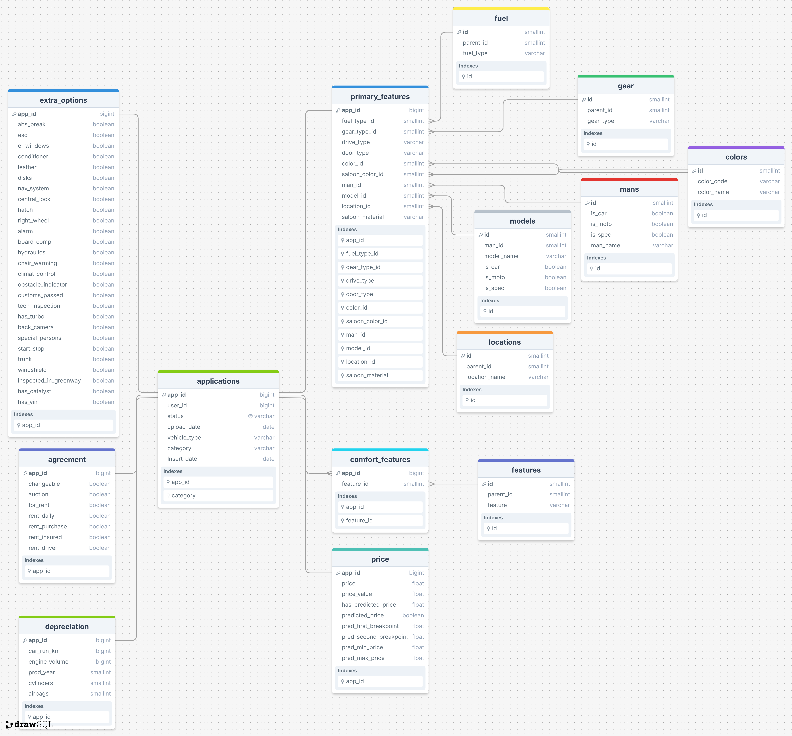

```{r setup, include = FALSE}

knitr::opts_chunk$set(
  collapse = TRUE,
  comment = "#>"
)
knitr::opts_chunk$set(warning = FALSE)
knitr::opts_chunk$set(message = FALSE)
# knitr::opts_chunk$set(cache   = TRUE)
knitr::opts_chunk$set(include = TRUE)
knitr::opts_chunk$set(echo    = FALSE)
```

```{r libs, include = FALSE}

packages <- c("readr",
              "dplyr",
              "ggplot2",
              "corrplot",
              "GGally",
              "knitr",
              "png")

install_if_missing <- function(pkg) {
  if (!requireNamespace(pkg, quietly = TRUE)) {
    install.packages(pkg)
  }
}

lapply(packages, install_if_missing)
lapply(packages, library, character.only = TRUE)
```

```{r data, include = FALSE}

price        <- read_csv("auto-market-dataset/price.csv")
depreciation <- read_csv("auto-market-dataset/depreciation.csv")
applications <- read_csv("auto-market-dataset/applications.csv")
primary      <- read_csv("auto-market-dataset/primary_features.csv")
models       <- read_csv("auto-market-dataset/models.csv")
extra        <- read_csv("auto-market-dataset/extra_options.csv")
mans         <- read_csv("auto-market-dataset/mans.csv")

# Juntando as tabelas pelas chaves
data <- price %>%
  inner_join(extra,        by = "app_id")             %>%
  inner_join(depreciation, by = "app_id")             %>%
  inner_join(applications, by = "app_id")             %>%
  inner_join(primary,      by = "app_id")             %>%
  inner_join(mans,         by = c("man_id"   = "id")) %>%
  inner_join(models,       by = c("model_id" = "id")) %>%
  select(-ends_with(".y"))                            %>%
  rename_with(~ sub("\\.x$", "", .), ends_with(".x"))

data <- data %>%
  filter(is_car == TRUE)

data <- data %>%
  select(app_id,
         price,
         car_run_km,
         prod_year,
         engine_volume,
         cylinders,
         airbags,
         abs_break,
         esd,
         el_windows,
         conditioner,
         leather,
         nav_system,
         model_name,
         category,
         man_id,
         man_name, )

data <- data %>%
  mutate(category_num = as.numeric(as.factor(data$category)))

# Retirando registros inconsistentes
data_filter <- data %>%
  filter(price         > 1000 &
         car_run_km    > 1000 &
         engine_volume > 0    &
         cylinders     > 0)
```

# Introdução

O dataset foi escolhido pela plataforma kaggle e trata de observações sobre o **mercado automotivo online da Georgia** no ano de **2024**.

Conforme o *schema* apresentado a seguir o dataset apresenta diversos detalhes sobre as vendas, condições do carro e outrs detalhes mais específicos.

Para esse trabalho, com o intuito de enfatizar os processos e análises que foram aprendidos na disciplina, tomamos liberdade de manipular o banco fornecido no site e descartar variáveis não utilizadas no modelo.

Abaixo também apresentamos uma tabela com as variáveis que escolhemos enfatizar e serão tratadas no modelo linear simulado.


```{r data_head}

col_names <- c("ID Aplicação",
               "Preço",
               "Quilometragem",
               "Ano Produção",
               "Volume do motor",
               "Cilindros",
               "Airbags",
               "Carro",
               "Modelo")

kable(head(data))
```


# Explorando o banco de dados

# Modelo Simples

# Modelo Multivariado

## Equação do modelo linear
A equação do modelo linear é dada por:
$$
\text{price} = \beta_0 + \beta_1 \cdot \text{car_run_km} + \beta_2 \cdot \text{prod_year} + \beta_3 \cdot \text{engine_volume} + \beta_4 \cdot \text{cylinders}
$$
```{r mult}

model <- lm(price ~ car_run_km
                  + prod_year
                  + engine_volume
                  + cylinders
                  + category_num
                  + airbags
                  + abs_break
                  + esd
                  + el_windows
                  + conditioner
                  + leather
                  + nav_system
                  + man_id
                  + category_num, data = data)

model_filter <- lm(price ~ car_run_km
                  + prod_year
                  + engine_volume
                  + cylinders
                  + category_num
                  + airbags
                  + abs_break
                  + esd
                  + el_windows
                  + conditioner
                  + leather
                  + nav_system
                  + man_id
                  + category_num, data = data_filter)

model_log <- lm(log(price) ~ car_run_km
                  + prod_year
                  + engine_volume
                  + cylinders
                  + category_num
                  + airbags
                  + abs_break
                  + esd
                  + el_windows
                  + conditioner
                  + leather
                  + nav_system
                  + man_id
                  + category_num, data = data_filter)

summary(model)
summary(model_filter)
summary(model_log)
```

## Interpretação dos Coeficientes
- $\beta_0$ (intercept) nos indica que o valor esperado quando do veículo quando *car_run_km* (quilometragem) e *prod_year* (ano de produção) são zero. Logo o beta_0 não tem interpretação prática pois o ano de produção não pode ser 0.

- ***car_run_km*** (Quilometragem): Para cada quilômetro adicional rodado, o preço do veículo aumenta em média 0.0001871 unidades monetárias, mantendo todas as outras variáveis constantes. \
Este coeficiente ***não*** **é estatisticamente significativo** (p-valor = 0.813).

- ***prod_year*** (Ano de produção): ara cada ano adicional de produção, o preço do veículo aumenta em média 2.676 unidades monetárias, mantendo todas as outras variáveis constantes. \
Este coeficiente ***não*** **é estatisticamente significativo** (p-valor = 0.402).

- ***engine_volume*** (volume do motor) : Para cada unidade adicional no volume do motor, o preço do veículo aumenta em média 1.583 unidades monetárias, mantendo todas as outras variáveis constantes. \
Este coeficiente **é estatisticamente significativo** (p-valor < 2e-16).

- ***cylinders*** (cilindro adicional):  Para cada cilindro adicional, o preço do veículo diminui em média 362.5 unidades monetárias, mantendo todas as outras variáveis constantes. \
Este coeficiente **é estatisticamente significativo** (p-valor = 6.31e-08).

## Interpretação do teste F

**F-statistic**: 90.11 \
**p-valor**: < 2.2e-16

- **F-statistic**: O valor de 90.11 indica que a variabilidade explicada pelo modelo é significativamente maior do que a variabilidade não explicada. Em outras palavras, o modelo como um todo é significativo.

- **p-valo**r: O p-valor é extremamente pequeno (< 2.2e-16), o que significa que a probabilidade de observar um valor de F tão extremo, ou mais extremo, sob a hipótese nula é praticamente zero.

- **Conclusão**:
  - Como o p-valor é muito menor que qualquer nível de significância comum (por exemplo, 0.05), rejeitamos a hipótese nula.
  - Isso indica que pelo menos uma das variáveis independentes no modelo tem um efeito significativo sobre a variável dependente (preço do veículo).
  - Portanto, o modelo de regressão linear é estatisticamente significativo e útil para prever o preço dos veículos com base nas variáveis incluídas

## Voltando a equação...

$$
\text{price} = \beta_0 + \beta_1 \cdot \text{car_run_km} + \beta_2 \cdot \text{prod_year} + \beta_3 \cdot \text{engine_volume} + \beta_4 \cdot \text{cylinders}
$$
Substituindo os valores dos coeficientes estimados, temos:

$$
\text{price} = -1239 + 0.0001871 \cdot \text{car_run_km} + 2.676 \cdot \text{prod_year} + 1.583 \cdot \text{engine_volume} - 362.5 \cdot \text{cylinders}
$$

## Gráficos do modelo encontrado
```{r}
# Gráficos de dispersão com linha de regressão ajustada
ggplot(data, aes(x = car_run_km, y = price)) +
  geom_point() +
  geom_smooth(method = "lm", col = "blue") +
  labs(title = "Relação entre Quilometragem e Preço", x = "Quilometragem (km)", y = "Preço")

ggplot(data, aes(x = prod_year, y = price)) +
  geom_point() +
  geom_smooth(method = "lm", col = "blue") +
  labs(title = "Relação entre Ano de Produção e Preço", x = "Ano de Produção", y = "Preço")

ggplot(data, aes(x = engine_volume, y = price)) +
  geom_point() +
  geom_smooth(method = "lm", col = "blue") +
  labs(title = "Relação entre Volume do Motor e Preço", x = "Volume do Motor", y = "Preço")

ggplot(data, aes(x = cylinders, y = price)) +
  geom_point() +
  geom_smooth(method = "lm", col = "blue") +
  labs(title = "Relação entre Número de Cilindros e Preço", x = "Número de Cilindros", y = "Preço")


```

#### Gráficos em log escala
```{r}
ggplot(data, aes(x = car_run_km, y = price)) +
  geom_point() +
  geom_smooth(method = "lm", col = "blue") +
  scale_y_log10() +
  labs(title = "Relação entre Quilometragem e Preço (Log Escala)", x = "Quilometragem (km)", y = "Preço (log)")

ggplot(data, aes(x = prod_year, y = price)) +
  geom_point() +
  geom_smooth(method = "lm", col = "blue") +
  scale_y_log10() +
  labs(title = "Relação entre Ano de Produção e Preço (Log Escala)", x = "Ano de Produção", y = "Preço (log)")

ggplot(data, aes(x = engine_volume, y = price)) +
  geom_point() +
  geom_smooth(method = "lm", col = "blue") +
  scale_y_log10() +
  labs(title = "Relação entre Volume do Motor e Preço (Log Escala)", x = "Volume do Motor", y = "Preço (log)")

ggplot(data, aes(x = cylinders, y = price)) +
  geom_point() +
  geom_smooth(method = "lm", col = "blue") +
  scale_y_log10() +
  labs(title = "Relação entre Número de Cilindros e Preço (Log Escala)", x = "Número de Cilindros", y = "Preço (log)")
```


#### EXTRAS (INTERESSANTES)
```{r}
# Gráficos de diagnóstico
par(mfrow = c(2, 2))  # Configura a área de plotagem para 2x2 gráficos
plot(model)
```

```{r, echo==TRUE}
# ggpairs(data)
```